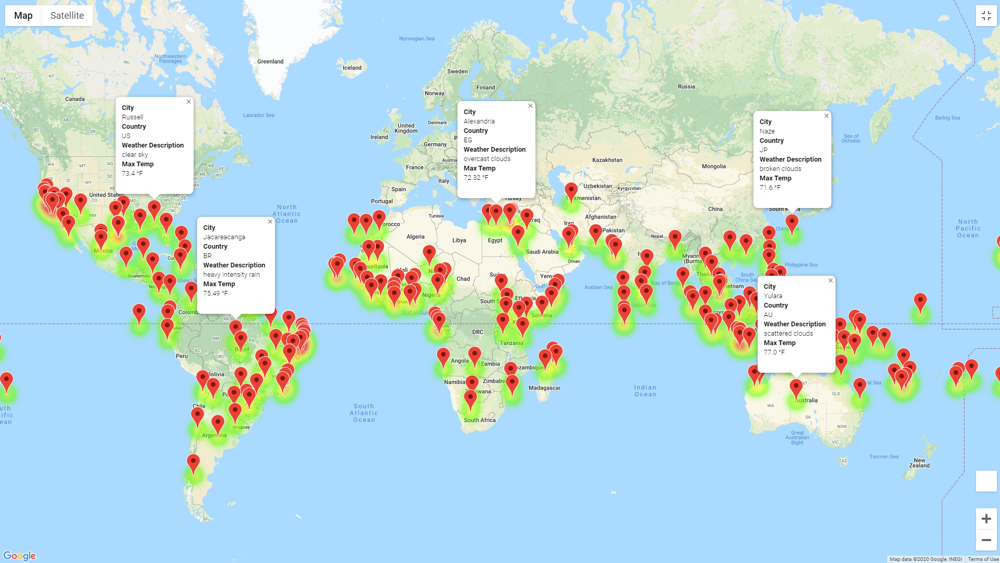
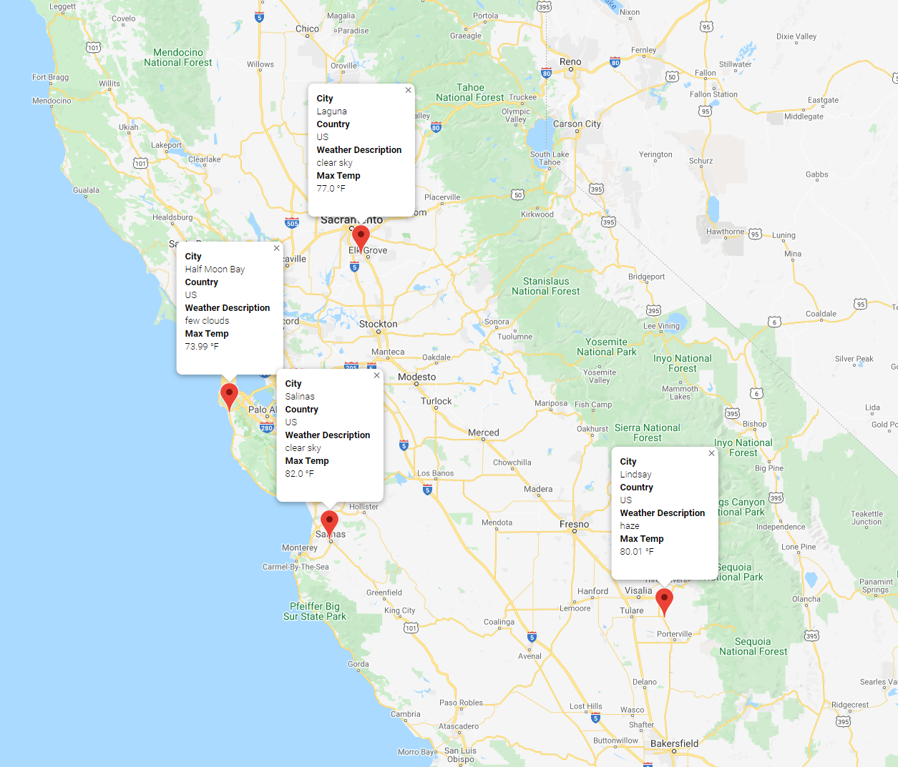
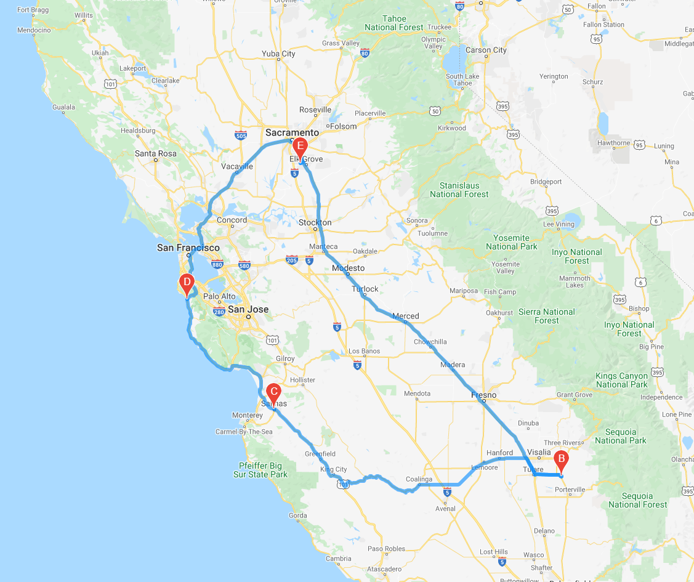

# WeatherPy With Python APIs

## Using Openweather and Google Maps APIs

2,000 randomly generated coordinates were made in order to have a large list for Openweather to start searching for. After finding the closest city, I pulled their respective Country, Latitude,	Longitude, Max Temperature,	Humidity, Cloudiness, Wind Speed and Current Weather Description. These statistics would come into play when helping customers decide what areas they would like to vacation to based on personal preference.

The above photo uses Google Maps API to generate city markers that when clicked will show a brief description of the area and the heat markers based on current maximum temperature. The preferences were based on user input; for this example between 70 to 85 degrees.

## Planning a Vacation?

Based on relative distance to each other I chose the cities of Laguna, Lindsay, Salinas and Half Moon Bay for a nice vacation in California. Since Fall is already half over finding an area to escape the cooler temperatures can be just what you need. First we start in Laguna and make our way southeast to Lindsay where there is the Sequoia National Forest nearby for any nature lovers out there. Next we head west toward the coast until we reach the town of Salinas also known as the Salad Bowl of the World. Definitely a place to brush up on some history of the town. Next up, we have Half Moon Bay to have a relaxing time near the beach and enjoy any water activities you can think of. Lastly we end back at Laguna which is close to Sacramento for anyone who flew from their home.

